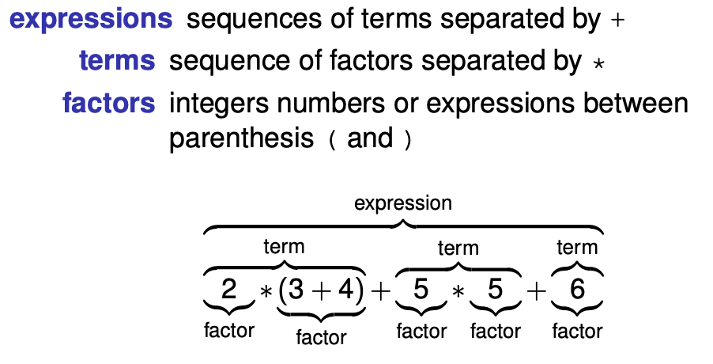

# Changelog
## Part 1: Extending the calculator for operations:
- Subtraction (-) 
- Integer Division (/) 
- Remainder (%)




To extend the functionalities on the calculator, first we need to extend the Expressions supported by it.

The calculator has 4 levels:
- The IO layer **(Do not change this layer for this part!)**
- The parser layer 
- The Evaluation layer
- The Data layer

The calculator parses the expression written in the IO terminal and then evaluates it.

For example, 

```
10+10+2
```

becomes

```
Add (Add (Num 10) (Num 10)) (Num 2)
Add (Num 20) (Num 2)
Num (22)
```


### Step 1: Extend data structure Expr 

```haskell
data Expr = Num Integer
          | Add Expr Expr
          | Mul Expr Expr
      +++ | Sub Expr Expr
      +++ | Div Expr Expr
      +++ | Mod Expr Expr
          deriving Show
```

### Step 2: Extend the evaluation logic on Eval

```haskell
    eval :: Expr -> Integer
    eval (Num n) = n
    eval (Add e1 e2) = eval e1 + eval e2
    eval (Mul e1 e2) = eval e1 * eval e2
+++ eval (Sub e1 e2) = eval e1 - eval e2
+++ eval (Div e1 e2) = eval e1 `div` e2
+++ eval (Mod e1 e2) = eval e1 `mod` e2
```

### Step 3: Extend the parser

Naturally, multiplication, division and modulus operations are **terms** and addition, subtraction and simple numbers are **factors**

```haskell
expr :: Parser Expr
expr = do t <- term
          exprCont t

exprCont :: Expr -> Parser Expr
exprCont acc = do char '+'
                  t <- term
                  exprCont (Add acc t)
               <|>
+++            do char '-'
+++               t <- term
+++               exprCont (Sub acc t)
               <|> return acc

term :: Parser Expr
term = do f <- factor
          termCont f

termCont :: Expr -> Parser Expr
termCont acc =  do char '*'
                   f <- factor
                   termCont (Mul acc f)
                <|>
+++             do char '/'
+++                f <- factor
+++                termCont (Div acc f)
                <|>
+++             do char '%'
+++                f <- factor
+++                termCont (Mod acc f)
                <|> return acc
```

## Part 2: Extending the Calculator to work with variables and commands 

### Step 1: Data structures

A command is either and assignment or an expression. 

```
Assignment -> variable '=' expression
Expression -> expression
``` 

And everytime there is an assignment, the variable should be stored to be used later. So, using a type that stores each variable and its value might be very useful:

```haskell
type Name = String
type Env = [(Name, Integer)]
```

Then, we need to extend the Expr data structure to be prepared to receive Variables:

```haskell
data Expr = Num Integer
          | Add Expr Expr
          | Mul Expr Expr
          | Sub Expr Expr
          | Div Expr Expr
          | Mod Expr Expr
+++       | Var Name
          deriving Show
```

Also, besides parsing expressions, we need now to parse commands, so a Command data structure can be useful:

```haskell
data Comm = Assign Name Expr
          | Evaluate Expr
```

### Step 2: Extending evaluator

The evaluator now should not only do arithmetic expressions with numbers, but should also get the numeric values from variables (based on the current environment) to those expressions.

Every evaluation should pass the current environment (which contains the numeric values of the variables) to perform operation 

Upon finding a variable, it should go through the environment to get the numeric value from the variable

```haskell
eval :: Env -> Expr -> Integer
eval env (Num n) = n
eval env (Add e1 e2) = eval env e1 + eval env e2
eval env (Mul e1 e2) = eval env e1 * eval env e2
eval env (Sub e1 e2) = eval env e1 - eval env e2
eval env (Div e1 e2) = eval env e1 `div` eval env e2
eval env (Mod e1 e2) = eval env e1 `mod` eval env e2
eval [] (Var name) = error "not found"
eval (env:envs) (Var name)
  | fst env == name = snd env
  | otherwise =  eval envs (Var name)
```

### Step 3: Extensing parsing logic

The arithmetic parsing should remain unchanged. The only thing left to do is to create new parsing functions to support commands, and a new parsing logic to parse variables.

```haskell
factor :: Parser Expr
+++ factor = do a <- variable
+++             return (Var a)
         <|>
         do n <- natural
            return (Num n)
         <|>
         do char '('
            e <- expr
            char ')'
            return e

+++ command :: Parser Comm
+++ command = do a <- variable 
+++              char '='
+++              e <- expr
+++              return (Assign a e)
+++           <|>
+++           do e <- expr
+++              return (Evaluate e)

natural :: Parser Integer
natural = do xs <- many1 (satisfy isDigit)
             return (read xs)

+++ variable :: Parser String
+++ variable = do xs <- many1 (satisfy isAlpha)
+++              return xs
```

Lastly, we need to change the IO logic to call the command logic.

```haskell
evaluate :: String -> String
evaluate txt
  = case parse expr txt of
      [ (tree, "") ] ->  show (eval tree)
      _ -> "parse error; try again"  
```

The project tells us to change the function to
```haskell
execute :: Env -> String -> (String, Env)
```
Since now we have 2 calculator options instead of 1 (Arithmetic Operations vs Variable Assignments + Arithmetic Operations with variables), we now need 2 IO operations:

```haskell
execute :: Env -> String -> (String, Env)
execute env txt 
  = case parse command txt of
    [ (tree, "")] -> case tree of
                        Assign name e -> let val = eval env e
                                             newEnv = (name, val) : env
                                         in (show val, newEnv)
                        Evaluate e -> (show (eval env e), env)
    _ -> ("parse error", env)
```

In Assign, we pass name (variable to be assigned a value to) and e (the expression) and we eval the expression. We store the value in a variable.

Then, we create a new Environment (to be used in future operations) and assign the new variable and its value to the previous environment. Haskell automatically removes the duplicate definitions, so it re-assigns in case of an already assigned variable.

In Evaluate, we do the same as previously defined, but now with 2 arguments.